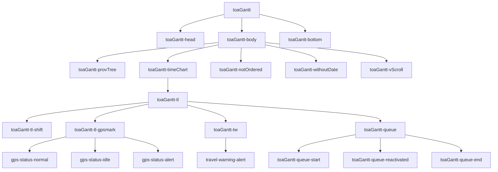

```mermaid
graph TD;
toaGantt --> toaGantt-head
toaGantt --> toaGantt-body
toaGantt --> toaGantt-bottom
toaGantt-body --> toaGantt-provTree
toaGantt-body --> toaGantt-timeChart
toaGantt-timeChart --> toaGantt-tl
toaGantt-tl --> toaGantt-tl-shift
toaGantt-tl --> toaGantt-tl-gpsmark
toaGantt-tl --> toaGantt-tw
toaGantt-tl --> toaGantt-queue
toaGantt-tw --> travel-warning-alert
toaGantt-queue --> toaGantt-queue-start
toaGantt-queue --> toaGantt-queue-reactivated
toaGantt-queue --> toaGantt-queue-end
toaGantt-tl-gpsmark --> gps-status-normal
toaGantt-tl-gpsmark --> gps-status-idle
toaGantt-tl-gpsmark --> gps-status-alert
toaGantt-body --> toaGantt-notOrdered
toaGantt-body --> toaGantt-withoutDate
toaGantt-body --> toaGantt-vScroll
```